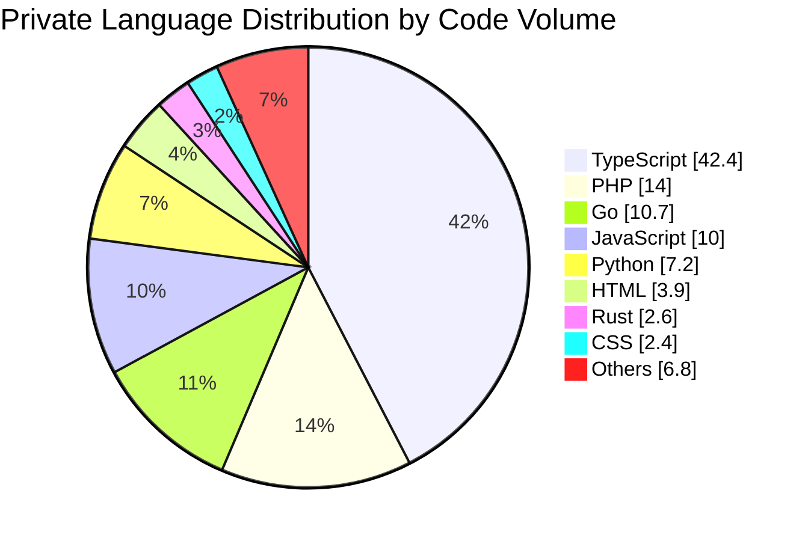

# Lamy

> Snow-minded Product Builder 
> AI / Infrastructure / Backend / Mobile

  
  
  
  

静かに積み上げるように、プロダクトと基盤をつくっています。 
AIを活用した開発体験、スケーラブルなバックエンド、モバイル体験、インフラ設計に関心があります。

---

## About

| Focus | Signal |
| --- | --- |
|  AI | AIを活用したプロダクト開発 |
|  Backend /  Infrastructure | Backend / Infrastructure を中心とした設計・実装 |
|  Mobile /  Frontend | Mobile / Frontend を含むユーザー体験づくり |
|  Product Builder | 小さく検証し、継続的に改善するProduct Builder志向 |

---

## Activity

日々の積み上げは、public activity として見える範囲だけを静かに可視化します。
private repositories の詳細は公開せず、GitHub Actions が `main` へのマージ後と定期実行で3D contribution graphを更新します。

<picture>
  <source media="(prefers-color-scheme: dark)" srcset="./profile-3d-contrib/profile-night-rainbow.svg">
  <source media="(prefers-color-scheme: light)" srcset="./profile-3d-contrib/profile-green-animate.svg">
  
</picture>

---

## Private Repository Insights

<!-- PRIVATE_TECH_START -->
### Private technology summary

| Technology | Code share | Category |
| --- | ---: | --- |
|  TypeScript | 42.4% | Language |
|  PHP | 14.0% | Language |
|  Go | 10.7% | Language |
|  JavaScript | 10.0% | Language |
|  Python | 7.2% | Language |
|  HTML | 3.9% | Language |
|  Rust | 2.6% | Language |
|  CSS | 2.4% | Language |

### Private framework & tool signals

<code> Hono</code> <code> React</code> <code> Express</code> <code> Gin</code> <code> Vite</code> <code> Astro</code> <code> Axum</code> <code> Expo</code> <code> Flutter</code> <code> Next.js</code>

_Private repositories are summarized only as coarse technology signals. Language shares use GitHub-reported code volume, and framework/tool signals come from repository topics plus common manifest files. Repository names, products, commits, branches, paths, exact code volume, repository counts, and business context are intentionally not published. Rust and Go are kept visible when GitHub reports them, even if they fall outside the top activity rows._
<!-- PRIVATE_TECH_END -->

---

## Principles

- Build quietly, improve continuously
- Keep private work private
- Share only safe, minimal engineering signals
- Design products with both users and operators in mind

---

## Contact

必要に応じて、GitHub上のpublic repositoriesまたはプロフィール経由でご連絡ください。
