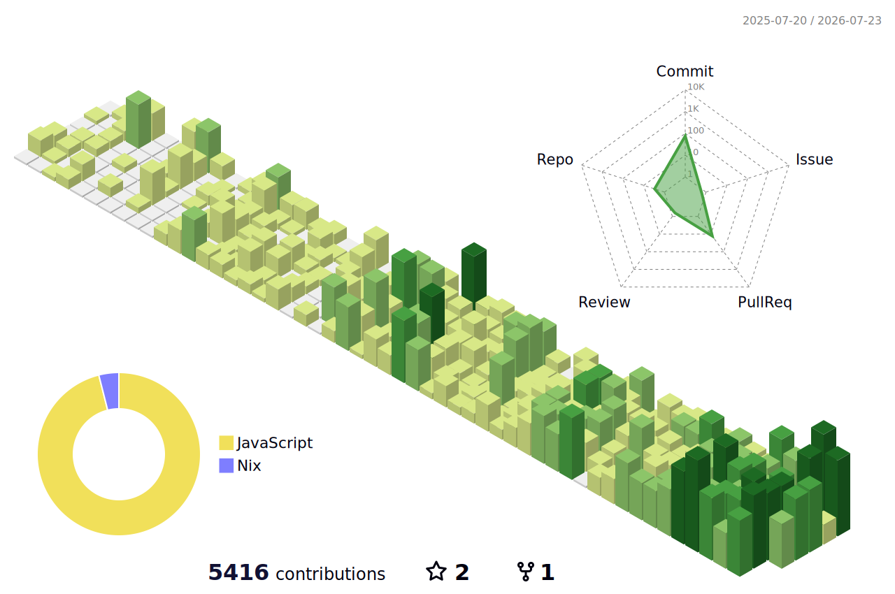

# Lamy

> Snow-minded Product Builder 
> AI / Infrastructure / Backend / Mobile

  
  
  
  

静かに積み上げるように、プロダクトと基盤をつくっています。 
AIを活用した開発体験、スケーラブルなバックエンド、モバイル体験、インフラ設計に関心があります。

---

## About

| Focus | Signal |
| --- | --- |
|  AI | AIを活用したプロダクト開発 |
|  Backend /  Infrastructure | Backend / Infrastructure を中心とした設計・実装 |
|  Mobile /  Frontend | Mobile / Frontend を含むユーザー体験づくり |
|  Product Builder | 小さく検証し、継続的に改善するProduct Builder志向 |

---

## Activity

日々の積み上げは、public activity として見える範囲だけを静かに可視化します。
private repositories の詳細は公開せず、GitHub Actions が `main` へのマージ後と定期実行で3D contribution graphを更新します。

<picture>
  <source media="(prefers-color-scheme: dark)" srcset="./profile-3d-contrib/profile-night-rainbow.svg">
  <source media="(prefers-color-scheme: light)" srcset="./profile-3d-contrib/profile-green-animate.svg">
  
</picture>

---

## Private Repository Insights

READMEに表示する技術シグナルは、内容に対応した安全なアイコン付きで表現します。
private technology summary は GitHub が検出した言語統計、各repositoryのprimary language signal、安全なtopic signalをもとに更新され、コード量だけでなく小さなGo / Rust repositoriesやframework傾向も反映されるようにします。
private repositories の具体的な情報は公開しません。 
repo名、commit、PR、issue、branch、file path、ファイル名はREADMEにもログにも出さず、公開する場合も集計済みの安全なコード量・割合・技術シグナルのみに限定します。

<!-- PRIVATE_TECH_START -->
### Private technology summary

Total detected private code volume: **132.4 MB**

| Language | Code volume | Usage share | Primary signal |
| --- | ---: | ---: | ---: |
|  TypeScript | 58.1 MB | 43.9% | 22 repos |
|  Python | 10.1 MB | 7.6% | 10 repos |
|  PHP | 19.6 MB | 14.8% | 2 repos |
|  JavaScript | 14.0 MB | 10.6% | 6 repos |
|  Go | 10.3 MB | 7.8% | 7 repos |
|  Shell | 1.83 MB | 1.4% | 4 repos |
|  HTML | 5.10 MB | 3.9% | 0 repos |
|  Rust | 3.33 MB | 2.5% | 1 repos |

_Aggregated from private repository language byte statistics, each repository's primary language signal, and safe repository topics for framework signals. Repository names, repository lists, commits, branches, file paths, and API responses are intentionally omitted. Rust and Go are kept visible when GitHub reports them, even if they fall outside the top activity rows._
<!-- PRIVATE_TECH_END -->

---

## Principles

- Build quietly, improve continuously
- Keep private work private
- Share only safe, minimal engineering signals
- Design products with both users and operators in mind

---

## Contact

必要に応じて、GitHub上のpublic repositoriesまたはプロフィール経由でご連絡ください。
